# Aviator Autobet Agent

> **A client-side security research tool demonstrating advanced automated interaction techniques with the Aviator crash game through multi-layered exploit vectors including WebSocket injection, Angular memory probing, and event listener hijacking.**

<p align="center">


-red?style=for-the-badge)


</p>

---

## Screenshot

<p align="center">
  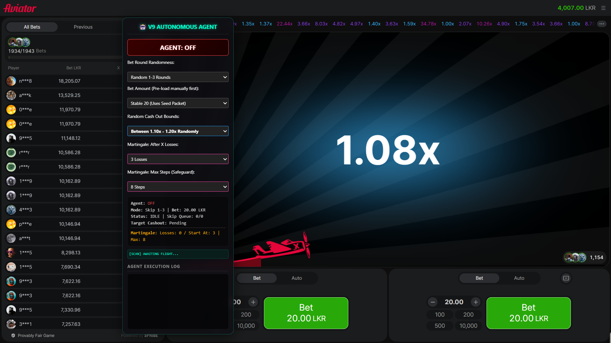
</p>

<p align="center"><i>The V9 Autonomous Agent control panel running alongside the Aviator game, displaying real-time agent state, configuration dropdowns, martingale tracker, and a live execution log.</i></p>

---

## Table of Contents

- [Overview](#overview)
- [System Architecture](#system-architecture)
- [Exploit Layers](#exploit-layers)
  - [Layer 1: Human Emulation Engine](#layer-1-human-emulation-engine)
  - [Layer 2: V9 Angular Memory Probe](#layer-2-v9-angular-memory-probe)
  - [Layer 3: V8 Network API Replay](#layer-3-v8-network-api-replay)
  - [Layer 4: V7 Event Listener Hijack](#layer-4-v7-event-listener-hijack)
- [Execution Priority & Fallback Chain](#execution-priority--fallback-chain)
- [Game State Machine](#game-state-machine)
- [Network Interception Pipeline](#network-interception-pipeline)
- [SFS Binary Protocol Parser](#sfs-binary-protocol-parser)
- [Configuration Reference](#configuration-reference)
  - [Skip Modes](#skip-modes)
  - [Bet Amount Strategies](#bet-amount-strategies)
  - [Cashout Target Modes](#cashout-target-modes)
- [Martingale Strategy Engine](#martingale-strategy-engine)
- [DOM Mutation Observer](#dom-mutation-observer)
- [UI Control Panel](#ui-control-panel)
- [Technical Specifications](#technical-specifications)
- [Installation](#installation)
- [Disclaimer](#disclaimer)
- [Educational Purpose](#educational-purpose)
- [For Security Researchers](#for-security-researchers)

---

## Overview

The `aviator-autobet-agent.js` is a **Tampermonkey UserScript** engineered to interface with the **Aviator crash game** (developed by Spribe) commonly deployed on online betting platforms. The agent operates as an autonomous system that intercepts, analyzes, and manipulates client-side communication channels to automate the entire bet-cashout lifecycle.

### Core Capabilities

| Capability | Technique | Description |
|:---|:---|:---|
| **Network Interception** | WebSocket MITM + Fetch/XHR Hooks | Captures and replays encrypted bet/cashout payloads directly over the native WebSocket transport |
| **Memory Exploitation** | Angular `__ngContext__` Probing | Traverses framework component hierarchies in JavaScript heap memory to locate and invoke internal methods |
| **Event Hijacking** | `EventTarget.prototype` Override | Steals click handlers before Angular's `isTrusted` validation, enabling replay with synthetic trusted events |
| **Human Emulation** | Hardware Cursor Tracking | Fires pixel-perfect synthetic mouse events at physical cursor coordinates to evade behavioral detection |
| **Protocol Parsing** | SmartFoxServer Binary Decoder | Decompresses and parses SFS2X binary protocol to extract real-time game state from raw WebSocket frames |
| **State Tracking** | Autonomous State Machine | Manages the full round lifecycle with automatic skip counting, bet execution, flight monitoring, and cashout triggers |

### Target Environment

| Property | Value |
|:---|:---|
| **Game** | Aviator by Spribe |
| **Platform** | Melbet, and other Spribe-integrated platforms |
| **Framework** | Angular (with SFS2X WebSocket backend) |
| **Injection Point** | `document-start` (pre-DOM, pre-framework initialization) |
| **Match Patterns** | `*://*/*/aviator*`, `*://*.spribegaming.com/*`, `https://*.melbet*.com/games-frame/games/*` |

---

## System Architecture

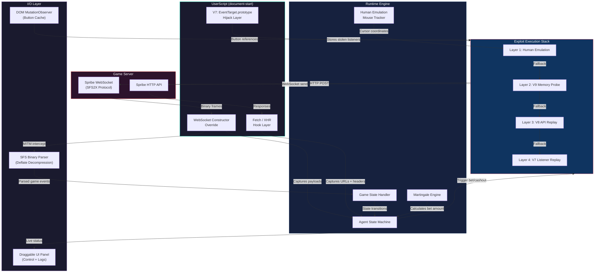

---

## Exploit Layers

The agent employs a **four-layer exploit stack** with automatic fallback. Each layer attempts execution in priority order; if one layer fails, the next is invoked automatically.

---

### Layer 1: Human Emulation Engine

The primary attack vector emulates real human interaction by tracking the user's physical mouse cursor and dispatching mathematically precise synthetic events at those exact coordinates.

```mermaid
sequenceDiagram
    participant Mouse as Physical Mouse
    participant Tracker as mousemove Listener
    participant Agent as Agent Engine
    participant Button as Target Button
    participant Angular as Angular Framework

    Mouse->>Tracker: Physical cursor movement
    Tracker->>Agent: Update A.mouse.x, A.mouse.y
    Agent->>Agent: Check cursor within button bounds
    Note over Agent: getBoundingClientRect() comparison

    rect rgb(40, 40, 60)
        Note over Agent,Button: Synthetic Event Dispatch Sequence
        Agent->>Button: pointerdown (clientX, clientY, buttons: 1)
        Agent->>Button: mousedown (clientX, clientY, buttons: 1)
        Agent->>Button: pointerup (clientX, clientY)
        Agent->>Button: mouseup (clientX, clientY)
        Agent->>Button: click (clientX, clientY)
        Agent->>Button: .click() (native DOM click)
    end

    Button->>Angular: Event propagation (bubbles: true)
    Angular->>Angular: Validate event properties
    Note over Angular: Passes coordinate checks
```

**Key Properties Set on Synthetic Events:**

| Property | Value | Purpose |
|:---|:---|:---|
| `bubbles` | `true` | Ensures event propagates through the DOM tree |
| `cancelable` | `true` | Allows framework to call `preventDefault()` |
| `composed` | `true` | Crosses shadow DOM boundaries |
| `buttons` | `1` | Indicates primary mouse button is pressed |
| `clientX` / `clientY` | Physical cursor position | Matches real hardware coordinates |
| `screenX` / `screenY` | Physical cursor position | Consistent with client coordinates |
| `view` | `window` | Associates event with the correct browsing context |

---

### Layer 2: V9 Angular Memory Probe

The V9 technique directly accesses the JavaScript heap memory attached to DOM elements to locate and forcefully invoke framework-internal component methods, completely bypassing the UI event pipeline.

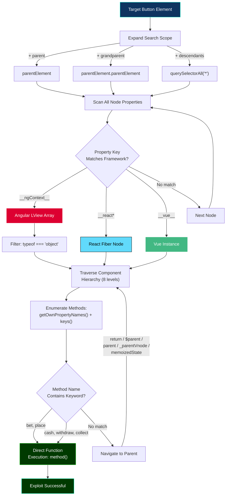

**Framework Property Detection:**

| Framework | Property Key | Data Structure | Traversal Method |
|:---|:---|:---|:---|
| **Angular 9+** | `__ngContext__` | LView Array | Filter objects from array, scan each |
| **React 16+** | `__reactFiber$*`, `__reactInternalInstance$*` | Fiber Node | Follow `.return` chain |
| **Vue 2/3** | `__vue__` | Component Instance | Follow `.$parent` / `._parentVnode` chain |

**Method Keyword Search:**

| Action | Keywords Scanned |
|:---|:---|
| Bet Placement | `bet`, `place` |
| Cashout Execution | `cash`, `withdraw`, `collect` |

---

### Layer 3: V8 Network API Replay

When DOM-based exploits fail, the agent replays previously captured HTTP request payloads (URLs, headers, and encrypted bodies) that were intercepted through hooked `fetch()` and `XMLHttpRequest` calls.

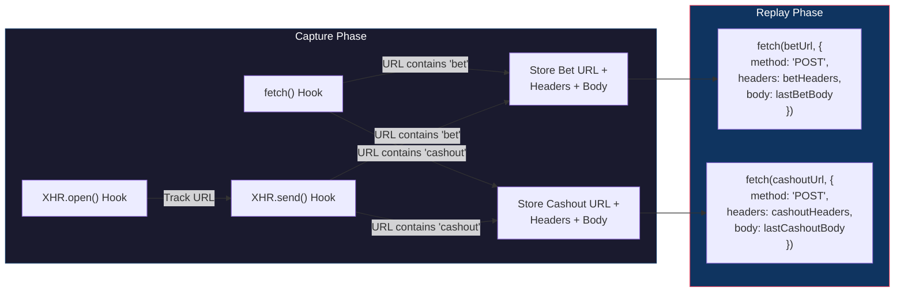

**Captured Session Parameters:**

| Parameter | Source | Usage |
|:---|:---|:---|
| `betUrl` | `fetch()` / `XHR.open()` | Target endpoint for bet replay |
| `betHeaders` | `fetch()` options / `XHR.setRequestHeader()` | Authentication + content-type headers |
| `lastBetBody` | `fetch()` body / `XHR.send()` payload | Encrypted request body |
| `cashoutUrl` | Same interception pipeline | Target endpoint for cashout replay |
| `cashoutHeaders` | Same interception pipeline | Authentication headers for cashout |
| `lastCashoutBody` | Same interception pipeline | Encrypted cashout payload |

---

### Layer 4: V7 Event Listener Hijack

The deepest fallback layer. At `document-start`, before Angular initializes, the script wraps `EventTarget.prototype.addEventListener` to intercept and store all click-related event handlers. These stolen references are later invoked with crafted event objects that spoof `isTrusted: true`.

```mermaid
sequenceDiagram
    participant Script as UserScript (document-start)
    participant Proto as EventTarget.prototype
    participant Angular as Angular Framework (loads later)
    participant Button as Bet/Cashout Button
    participant Agent as Agent Engine

    Script->>Proto: Override addEventListener()
    Note over Script,Proto: Wraps original with interception logic

    Angular->>Button: addEventListener('click', handler)
    Button->>Proto: Wrapped addEventListener called
    Proto->>Proto: Store handler in __av_listeners.click[]
    Proto->>Button: Original addEventListener (handler registered normally)

    Note over Agent: When exploit layers 1-3 fail...
    Agent->>Button: Read __av_listeners.click[]
    Agent->>Agent: Construct fake event object

    rect rgb(60, 30, 30)
        Note over Agent: Spoofed Event Object
        Agent->>Agent: { isTrusted: true, type: 'click',<br/>target: button, preventDefault: ()=>{} }
    end

    Agent->>Button: listener(fakeEvent)
    Button->>Angular: Handler executes with spoofed trust
    Note over Angular: isTrusted check passes
```

**Intercepted Event Types:**

| Event Type | Purpose |
|:---|:---|
| `click` | Standard click handler capture |
| `pointerdown` | Pointer event handler capture |
| `touchstart` | Mobile touch handler capture |

**Storage Mechanism:**

```
Element.__av_listeners = {
    click: [handler1, handler2, ...],
    pointerdown: [handler1, ...],
    touchstart: [handler1, ...]
}
```

The `__av_listeners` property is defined as **non-enumerable** via `Object.defineProperty()`, making it invisible to framework-level property enumeration and standard `for...in` loops.

---

## Execution Priority & Fallback Chain

The agent uses a **cascading priority system** where each exploit layer serves as a fallback for the previous one. This ensures maximum reliability across different runtime conditions.

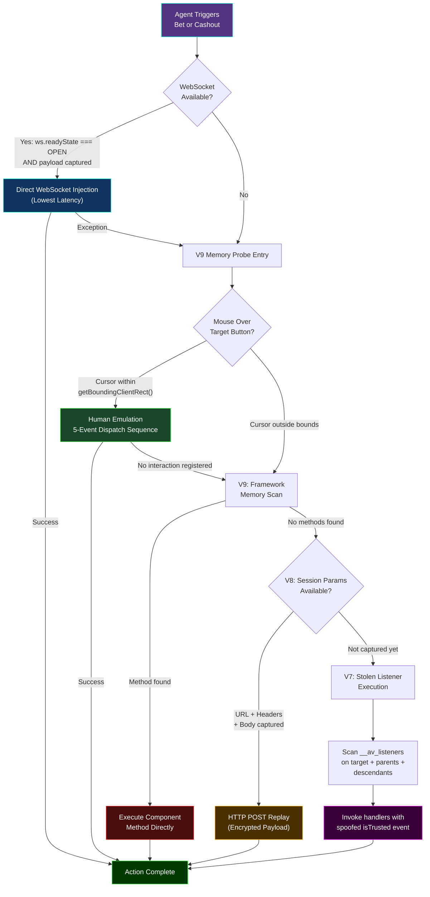

### Priority Summary

| Priority | Layer | Technique | Latency | Reliability |
|:---:|:---|:---|:---|:---|
| **1** | WebSocket Injection | Direct `ws.send()` with modified payload | Lowest (~0ms overhead) | Requires prior payload capture |
| **2** | Human Emulation | Synthetic MouseEvent at cursor coordinates | Low (~5ms) | Requires cursor over button |
| **3** | V9 Memory Probe | Direct JS heap method invocation | Medium (~10-50ms) | Framework-dependent |
| **4** | V8 API Replay | HTTP POST with captured encrypted body | Medium (~50-200ms) | Requires prior request capture |
| **5** | V7 Listener Hijack | Stolen handler invocation with spoofed event | Low (~5ms) | Requires pre-init injection |

---

## Game State Machine

The agent tracks the Aviator game through a finite state machine synchronized with the server's `changeState` WebSocket messages.

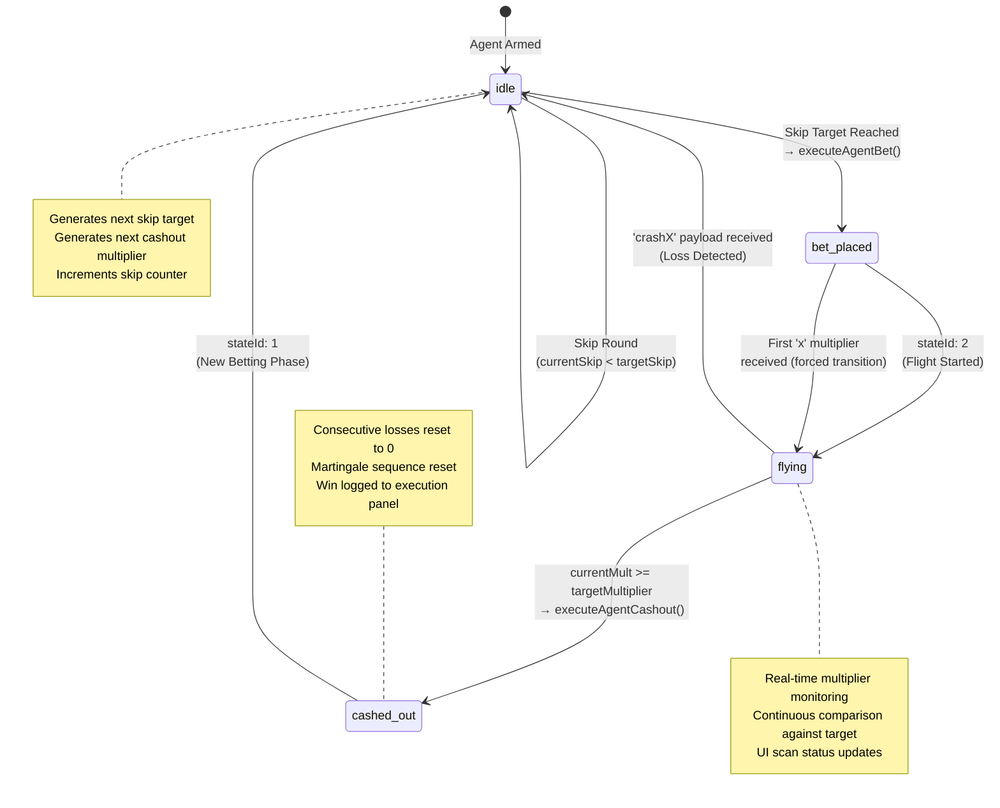

### State Transition Reference

| From State | To State | Trigger | Server Event |
|:---|:---|:---|:---|
| `idle` | `idle` | Round skipped (skip counter not met) | `changeState` → `newStateId: 1` |
| `idle` | `bet_placed` | Skip target reached, bet executed | `changeState` → `newStateId: 1` |
| `bet_placed` | `flying` | Flight phase begins | `changeState` → `newStateId: 2` |
| `bet_placed` | `flying` | Live multiplier `x` received (forced) | WebSocket `c: "x"` message |
| `flying` | `cashed_out` | Target multiplier reached | Agent triggers cashout |
| `flying` | `idle` | Crash before target (loss) | `crashX` payload in WebSocket |
| `cashed_out` | `idle` | New round begins | `changeState` → `newStateId: 1` |

---

## Network Interception Pipeline

The agent hooks into three communication layers to capture and manipulate game traffic.

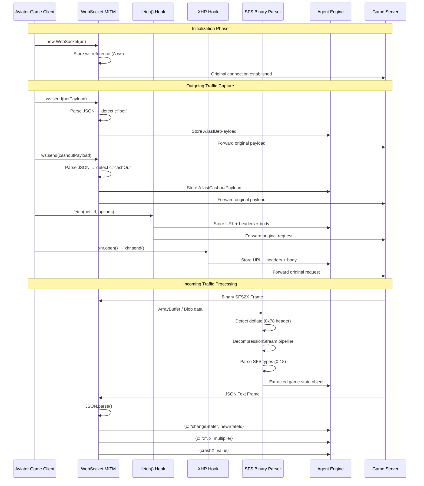

---

## SFS Binary Protocol Parser

The agent includes a custom **SmartFoxServer 2X (SFS2X)** binary protocol parser capable of decompressing and decoding the game server's binary WebSocket frames into readable JSON-like objects.

### Decompression Pipeline

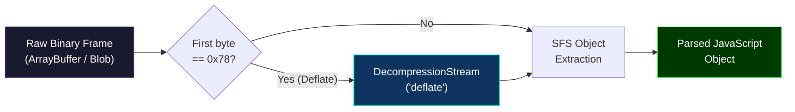

### Supported SFS Data Types

| Type ID | Data Type | Size | Parse Method |
|:---:|:---|:---|:---|
| 0 | Null | 0 bytes | Returns `null` |
| 1 | Boolean | 1 byte | `!!bytes[offset]` |
| 2 | Byte | 1 byte | Direct read |
| 3 | Short | 2 bytes | `getInt16()` big-endian |
| 4 | Int | 4 bytes | `getInt32()` big-endian |
| 5 | Long | 8 bytes | `getBigInt64()` big-endian |
| 6 | Float | 4 bytes | `getFloat32()` big-endian |
| 7 | Double | 8 bytes | `getFloat64()` big-endian |
| 8 | String | 2 + N bytes | Length-prefixed UTF-8 |
| 17 | SFSArray | 2 + recursive | Recursive type-tagged array |
| 18 | SFSObject | 2 + recursive | Recursive key-value map |

---

## Configuration Reference

### Skip Modes

Controls the number of game rounds the agent will observe before placing the next bet. The skip count is randomized within the selected range for each cycle.

| Mode | Range | Rounds Skipped | Risk Profile |
|:---:|:---|:---|:---|
| `1-3` | 1 to 3 rounds | Low skip count | Higher frequency betting **(default)** |
| `4-5` | 4 to 5 rounds | Medium skip count | Moderate frequency |
| `6-10` | 6 to 10 rounds | High skip count | Conservative frequency |

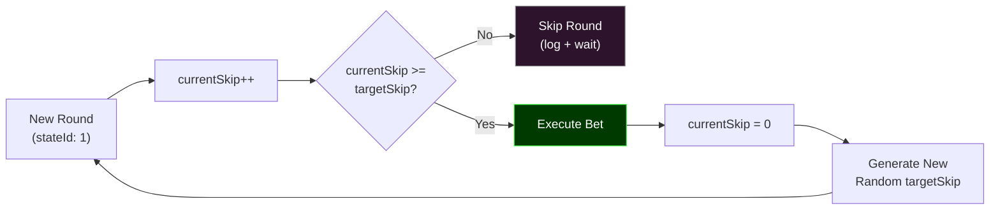

---

### Bet Amount Strategies

| Mode | Name | Behavior | Amount Range |
|:---:|:---|:---|:---|
| `stable20` | **Stable 20** | Fixed amount every round | 20 |
| `random4060100` | **Random Selection** | Randomly picks from three values | 40, 60, or 100 |
| `martingale` | **Martingale** | Doubles after consecutive losses | 20 → 40 → 80 → 160 → ... |

---

### Cashout Target Modes

The agent automatically triggers cashout when the live multiplier reaches a randomly selected value within the configured range.

| Mode | Range | Multiplier Window | Risk / Reward |
|:---:|:---|:---|:---|
| `1.10-1.20` | 1.10x to 1.20x | Very tight window | Low risk, low reward **(default)** |
| `1.50-1.98` | 1.50x to 1.98x | Moderate window | Medium risk, medium reward |
| `2.00-2.97` | 2.00x to 2.97x | Wide window | High risk, high reward |

---

## Martingale Strategy Engine

The martingale engine implements a loss-recovery doubling strategy with configurable grace period and safety limits.

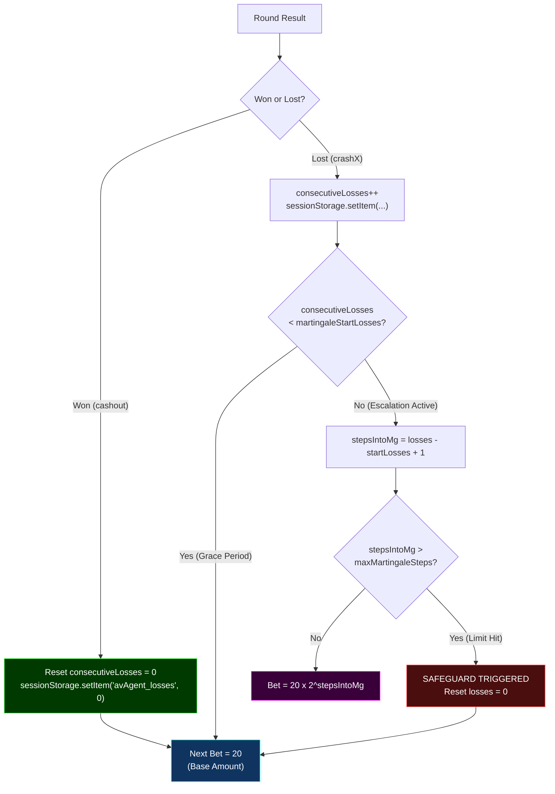

### Martingale Escalation Table

With default configuration (`martingaleStartLosses: 3`, `maxMartingaleSteps: 8`, base bet: 20):

| Consecutive Losses | Step | Bet Amount | Cumulative Risk |
|:---:|:---:|---:|---:|
| 1 | Grace | 20 | 20 |
| 2 | Grace | 20 | 40 |
| 3 | Grace | 20 | 60 |
| 4 | Step 1 | 40 | 100 |
| 5 | Step 2 | 80 | 180 |
| 6 | Step 3 | 160 | 340 |
| 7 | Step 4 | 320 | 660 |
| 8 | Step 5 | 640 | 1,300 |
| 9 | Step 6 | 1,280 | 2,580 |
| 10 | Step 7 | 2,560 | 5,140 |
| 11 | Step 8 | 5,120 | 10,260 |
| 12+ | **Safeguard** | **20 (Reset)** | **—** |

### Persistence

Loss count is persisted in `sessionStorage` under the key `avAgent_losses`, ensuring the martingale sequence survives page refreshes within the same browser session.

---

## DOM Mutation Observer

The agent uses a `MutationObserver` to continuously monitor the DOM for dynamically rendered bet and cashout buttons, caching references for the exploit stack.

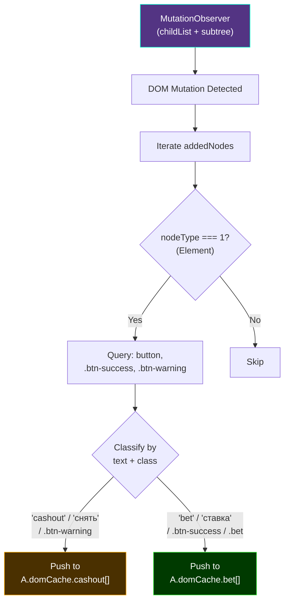

**Detection Criteria:**

| Button Type | Text Keywords | CSS Classes |
|:---|:---|:---|
| **Bet Button** | `bet`, `ставка` (Russian) | `.btn-success`, `.bet` |
| **Cashout Button** | `cashout`, `снять` (Russian) | `.btn-warning` |

---

## UI Control Panel

The agent injects a **draggable, glassmorphism-styled control panel** into the game DOM with real-time status display and configuration controls.

### Panel Components

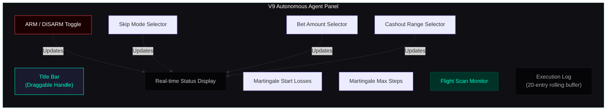

### Status Display Fields

| Field | Description | Example |
|:---|:---|:---|
| **Agent** | Armed status indicator | `ARMED` (green) / `OFF` (red) |
| **Mode** | Current skip mode + bet amount | `Skip 1-3 | Bet: 20.00 LKR` |
| **Status** | Current bet state + skip progress | `FLYING | Skip Queue: 2/3` |
| **Target Cashout** | Generated multiplier target | `1.15x` |
| **Martingale** | Loss counter + configuration | `Losses: 2 / Start At: 3 | Max: 8` |

### Execution Log

The log panel maintains a **rolling buffer of 20 entries** with color-coded messages:

| Color | Category |
|:---|:---|
| `#11ff11` | Human emulation events |
| `#ff2a2a` | V9 memory probe hits |
| `#4cff4c` | Successful actions (WebSocket inject, wins) |
| `#ffaa00` | Warnings and fallback triggers |
| `#ff00ff` | V7 hijack execution / martingale escalation |
| `#ff4444` | Losses and safeguard triggers |
| `#00ffcc` | Payload captures |
| `#ffff00` | Target multiplier generation |
| `#0ff` | Flight monitoring |

---

## Technical Specifications

| Specification | Value |
|:---|:---|
| **Script Type** | Tampermonkey UserScript |
| **Injection Timing** | `document-start` (before DOM and framework init) |
| **Total Lines of Code** | ~1,098 |
| **External Dependencies** | None (zero dependencies) |
| **Browser APIs Used** | `EventTarget`, `WebSocket`, `fetch`, `XMLHttpRequest`, `MutationObserver`, `DecompressionStream`, `DataView`, `sessionStorage` |
| **Overridden Prototypes** | `EventTarget.prototype.addEventListener`, `WebSocket` constructor, `XMLHttpRequest.prototype.open/send/setRequestHeader`, `window.fetch` |
| **Memory Probe Depth** | 8 levels of component hierarchy traversal |
| **Log Buffer Size** | 20 entries (FIFO rolling) |
| **Input Injection Delay** | 150ms (Angular digest cycle yield) |
| **Panel Style** | Glassmorphism with `backdrop-filter: blur(10px)` |
| **Drag System** | Custom mousedown/mousemove/mouseup implementation |

---

## Installation

### Prerequisites

| Requirement | Details |
|:---|:---|
| **Browser** | Chrome, Firefox, Edge, or any Chromium-based browser |
| **Extension** | [Tampermonkey](https://www.tampermonkey.net/) or [Greasemonkey](https://www.greasespot.net/) |

### Steps

1. Install **Tampermonkey** from your browser's extension store
2. Click the Tampermonkey icon and select **"Create a new script"**
3. Delete the template content and paste the entire contents of `aviator-autobet-agent.js`
4. Press `Ctrl+S` to save the script
5. Navigate to a supported platform URL matching the script's `@match` patterns
6. The **V9 Autonomous Agent** panel will appear in the top-right corner of the game window

### Supported URL Patterns

```
*://*/*/aviator*
*://*.spribegaming.com/*
https://melbet-srilanka.com/games-frame/games/*
https://*.melbet*.com/games-frame/games/*
```

---

## Disclaimer

> **THIS SOFTWARE IS PROVIDED "AS IS" WITHOUT WARRANTY OF ANY KIND, EXPRESS OR IMPLIED.**

| # | Warning |
|:---:|:---|
| 1 | **Terms of Service Violation** — This script likely violates the Terms of Service (ToS) and End User License Agreements (EULAs) of targeted betting platforms. Use may result in account suspension, banning, or legal action. |
| 2 | **Legal Implications** — The use of automated tools to interact with online gambling platforms may be illegal in your jurisdiction. You are solely responsible for ensuring compliance with all applicable laws and regulations. |
| 3 | **Financial Risk** — Automated gambling carries significant financial risk. The creators and contributors of this project accept no responsibility for any financial losses incurred. |
| 4 | **Account Termination** — Betting platforms actively detect and block automated tools. Use may result in permanent account termination and forfeiture of funds. |
| 5 | **No Liability** — The author(s) of this software shall not be held liable for any damages, losses, or consequences arising from the use or misuse of this script. |

---

## Educational Purpose

> This project is intended solely for **educational** and **defensive security research purposes**.

### What This Demonstrates

#### Web Application Security Vulnerabilities

This script serves as a practical case study in how client-side web applications can be vulnerable to multiple attack vectors operating simultaneously:

| Attack Vector | Security Concept | Defense Implications |
|:---|:---|:---|
| Event listener interception | Prototype pollution / override | Freeze prototypes, use `Object.freeze(EventTarget.prototype)` |
| Client-side memory probing | Framework internals exposure | Obfuscate component property names, minimize public methods |
| WebSocket message replay | Transport-layer trust issues | Implement server-side nonce validation, per-message signatures |
| DOM-based click synthesis | Event trust model weaknesses | Enforce server-side action validation, not client-side `isTrusted` |
| HTTP request replay | Stateless API exploitation | Use one-time tokens, request signing, and replay detection |

#### Defensive Research Applications

Security researchers can use this code to:

- Understand multi-layered client-side attack methodologies
- Develop detection mechanisms for synthetic events and prototype overrides
- Strengthen WebSocket protocol security against message replay
- Test and improve anti-automation behavioral analysis systems
- Build server-side validation that doesn't rely on client-side trust

#### Academic Study Topics

| Topic | Relevant Code Section |
|:---|:---|
| Browser extension / UserScript lifecycle | Script metadata block, `@run-at document-start` |
| JavaScript prototype chain manipulation | `EventTarget.prototype.addEventListener` override |
| WebSocket protocol internals | `WebSocket` constructor override, `ws.send()` hook |
| Binary protocol reverse engineering | SFS2X parser (`parseSfsType`, `extractSFSObjects`) |
| Framework memory layout (Angular, React, Vue) | V9 Memory Probe (`__ngContext__`, `__reactFiber`, `__vue__`) |
| Behavioral detection evasion | Mouse tracking + synthetic `MouseEvent` dispatch |
| DOM observation patterns | `MutationObserver` for dynamic button detection |

### Prohibited Uses

You are **expressly prohibited** from using this software to:

- Automate gambling or betting on any platform
- Exploit vulnerabilities for financial gain
- Violate any applicable laws or regulations
- Cause harm to any person, organization, or system

---

## For Security Researchers

If you are conducting defensive security research, the following areas present the most valuable study opportunities:

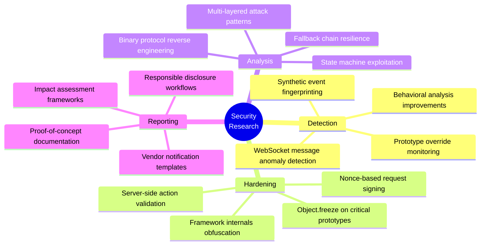

---

<p align="center">
<b>Author:</b> Dineth Pramodya<br/>
<b>License:</b> Educational Use Only<br/>
<b>Last Updated:</b> March 2026
</p>

<p align="center"><i>This documentation is for educational purposes only. The maintainers assume no responsibility for misuse of this information.</i></p>
